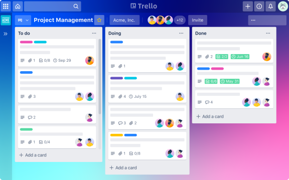
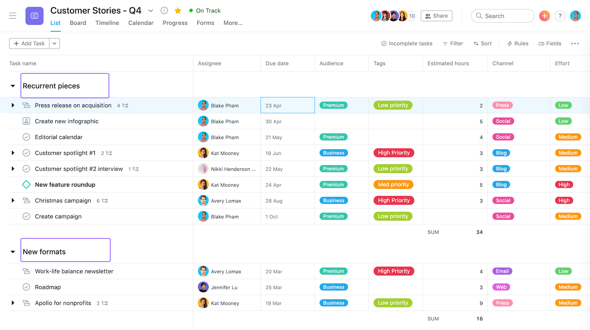

# Ferramentas Kanban
```
Existem centenas de softwares de fluxo de trabalho. Tal como diversas ferramentas Kanban no mercado. Contudo, cada um tem seu próprio conjunto de recursos e serviços. Portanto, encontrar o ajuste certo para sua organização requer algumas pesquisas. Para ajudá-lo a começar, aqui estão algumas ferramentas Kanban populares:
```

# Trello
```
O Trello é uma das ferramentas Kanban mais populares. 

É comumente usado por equipes de desenvolvimento de software ágil. Entretanto, também é usado para marketing, vendas, suporte e RH. Afinal, o Trello oferece ferramentas colaborativas. Ou seja, permite aos usuários compartilhar calendários, lembretes, tarefas e prazos. 

Além disso, os usuários podem deixar comentários sobre as tarefas. Dessa forma, eles atualizam os demais sobre o andamento daquele item no fluxo de trabalho.

Portanto, o Trello é uma ótima opção para grandes equipes. Ou, pelo menos, para projetos espalhados por departamentos. Afinal, todos podem:
- Se manter atualizados sobre o andamento do projeto e da tarefa;
- Compartilhar novas ideias ou atualizações;
- Fornecer feedback em tempo real;
- Interagir durante o desenvolvimento ou ciclo de vida do projeto.
```

# Jira
```
A interface do usuário é limpa e simples. Ou seja, traz um quadro Kanban direto e recursos colaborativos. Você pode escolher entre fluxos de trabalho pré-configurados ou criar seu próprio fluxo conforme sua equipe trabalha. Além disso, você também pode criar roteiros de software em Jira. Afinal, eles ajudam a TI a alinhar o processo de desenvolvimento com as metas organizacionais.

O Jira se integra a mais de 3.000 outros aplicativos. Portanto, permite que as empresas criem uma experiência personalizada para suas equipes. Ele também está entre as ferramentas Kanban mais analisadas no Software Advice. Afinal, tem quase 9.400 análises e uma classificação de 4,4 estrelas.
```

# Asana
```
O Asana tem uma ampla gama de recursos para Kanban. Ou seja, atende:

- Gerenciamento ágil de projetos;
- Rastreamento de bugs;
- Gestão de processos de negócios;
- Colaboração;
- Gerenciamento de produtos;
- Roadmapping;
- Gestão de recursos e mais.


É uma ferramenta de desenvolvimento bem completa. Além disso, ela oferece um rico conjunto de recursos de gerenciamento de fluxo de trabalho. Não obstante, o Asana regularmente adiciona novos recursos. Estes visam torná-lo mais personalizável para os usuários. 

Contudo, a lista de recursos é longa. Porém, saiba que o software inclui:

- Cronogramas;
- Calendários;
- Modelos personalizados;
- Recursos robustos de relatórios;
- Capacidade de conectar o trabalho entre equipes e objetivos da empresa. 
```

